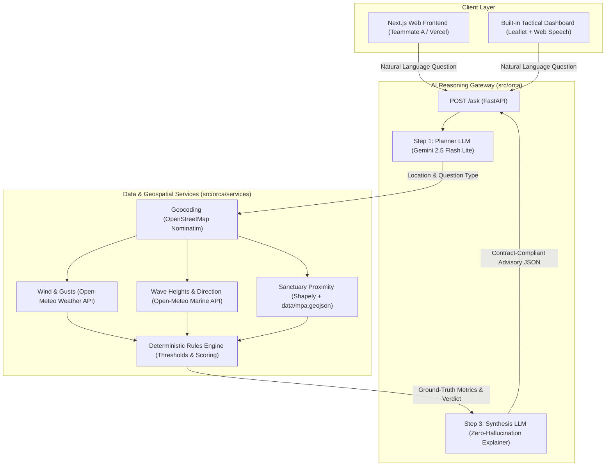

# ORCA Marine — AI Maritime Safety Assistant ⚓

> **Smart India Hackathon (SIH) — Problem Statement 26176**  
> *Reasoning Across Disparate Oceanographic, Weather, and Geospatial Data*

[](https://www.python.org/)
[](https://fastapi.tiangolo.com/)
[](https://ai.google.dev/)
[](https://open-meteo.com/)
[](https://shapely.readthedocs.io/)

ORCA is an AI-powered maritime safety reasoning assistant designed to help small craft navigators, coastal fishermen, and harbor authorities make instant, data-grounded safety decisions. By fusing real-time atmospheric wind forecasts, oceanic wave observations, and Marine Protected Area (MPA) boundaries, ORCA delivers **zero-hallucination** natural-language advisories in seconds.

---

## 🏗️ System Architecture



---

## 📁 Monorepo Structure

```text
ORCA-Marine/
├── frontend/                       # Next.js Frontend Application (Teammate A)
│   └── README.md                   # Frontend setup & Vercel deployment guide
├── src/orca/                       # Core FastAPI & Agentic AI Backend
│   ├── app.py                      # FastAPI application & route gateway
│   ├── planner.py                  # Step 1: Planner LLM query classifier
│   ├── synthesis.py                # Step 3: Synthesis LLM explanation generator
│   ├── rules_stub.py               # Deterministic safety rules & threshold engine
│   ├── fixtures.py                 # KHA-23 offline rehearsal fixtures
│   ├── services/                   # Live data & geospatial integration services
│   │   ├── weather.py              # Open-Meteo forecast fetcher
│   │   ├── marine.py               # Open-Meteo marine wave fetcher
│   │   ├── geocoding.py            # OpenStreetMap Nominatim reverse geocoder
│   │   ├── mpa.py                  # Shapely polygon distance calculator
│   │   └── teammate_client.py      # Cloud microservice client for Render
│   └── static/
│       └── index.html              # Standalone interactive tactical map dashboard
├── data/
│   └── mpa.geojson                 # Indian Marine Protected Areas (72 KB GeoJSON)
├── scripts/                        # Automated test suites & verification benchmarks
│   ├── test_planner.py             # KHA-18 planner extraction verification
│   ├── test_synthesis.py           # KHA-19 zero-hallucination verification
│   ├── test_ask_route.py           # KHA-20 end-to-end route tests
│   ├── test_sources.py             # KHA-21 dynamic citation resilience
│   ├── test_adversarial.py         # KHA-22 prompt injection hardening
│   ├── test_demo_mode.py           # KHA-23 sub-15ms offline rehearsal tests
│   └── benchmark_timing.py         # KHA-24 latency profiling & benchmarks
├── CONTRACT.md                     # Shared API contract & TypeScript schema
├── DEMO_SCRIPT.md                  # 5-minute timed presentation script & cues
├── requirements.txt                # Python backend dependencies
├── render.yaml                     # Render cloud deployment blueprint
├── .env.example                    # Environment variable template
└── README.md                       # Project overview & documentation
```

---

## ✨ Core Features

1. **Natural-Language Intent Planning (`planner.py`)**:  
   Extracts coastal locations and categorizes inquiries (`sea_conditions`, `protected_area`, `unsupported`) without requiring separate form fields.
2. **Zero-Hallucination Explanations (`synthesis.py`)**:  
   Enforces strict mathematical traceability—every metric (wind speed, wave height, sanctuary distance) cited in the natural language explanation must match ground-truth API telemetry exactly.
3. **Dynamic Citation Channel Resilience (`rules_stub.py`)**:  
   Independent channels for weather, ocean waves, and sanctuary boundaries gracefully omit degraded sources without crashing.
4. **Offline Rehearsal Engine (`fixtures.py`)**:  
   Sub-15ms offline fixture responses for Mangaluru, Goa, and Mumbai guarantee presentation certainty even under complete network failure.
5. **Interactive Tactical Dashboard (`index.html`)**:  
   A full-featured visual dashboard mounted at `/dashboard` with an interactive Leaflet map, MPA boundary polygon overlays, colored verdict badges, and Web Speech API audio playback.

---

## 🚀 Quickstart Guide

### 1. Prerequisites
- Python 3.10, 3.11, 3.12, 3.13, or 3.14
- Google Gemini API Key ([Get one free at Google AI Studio](https://aistudio.google.com/))

### 2. Installation
```powershell
# Clone the repository
git clone https://github.com/<YOUR_ORGANIZATION>/ORCA-Marine.git
cd ORCA-Marine

# Create and activate virtual environment
python -m venv .venv
.\.venv\Scripts\activate   # On Linux/macOS: source .venv/bin/activate

# Install dependencies
pip install -r requirements.txt
```

### 3. Environment Configuration
Create a `.env` file from the template:
```powershell
cp .env.example .env
```
Add your API key:
```env
GEMINI_API_KEY=AIzaSy...
```

### 4. Run the Backend & Tactical Dashboard
```powershell
uvicorn src.orca.app:app --host 0.0.0.0 --port 8000 --reload
```
- **Tactical Dashboard**: [http://localhost:8000/](http://localhost:8000/) or [http://localhost:8000/dashboard](http://localhost:8000/dashboard)
- **Interactive Swagger Docs**: [http://localhost:8000/docs](http://localhost:8000/docs)

---

## 🧪 Automated Verification Test Suites

Run the complete test battery from the repository root:

```powershell
# Verify Planner LLM extraction across 8 edge cases
python scripts/test_planner.py

# Verify Zero-Hallucination synthesis across all safety scenarios
python scripts/test_synthesis.py

# Verify end-to-end /ask contract compliance
python scripts/test_ask_route.py

# Verify dynamic source citation & fault injection resilience
python scripts/test_sources.py

# Verify adversarial prompt injection defense (5 jailbreak attacks)
python scripts/test_adversarial.py

# Verify instant (<15ms) offline rehearsal fixtures
python scripts/test_demo_mode.py

# Benchmark component latencies and generate timing profile
python scripts/benchmark_timing.py
```

---

## ☁️ Cloud Deployment

### Backend (Render)
1. Fork or push this repository to GitHub.
2. Log in to [Render](https://render.com) and click **New +** $\rightarrow$ **Web Service**.
3. Connect your repository. Render will automatically detect `render.yaml`.
4. Add your `GEMINI_API_KEY` under Environment Variables.
5. Deploy!

### Frontend (Vercel)
1. Log in to [Vercel](https://vercel.com) and import the same repository.
2. Set the **Root Directory** to `frontend`.
3. Set `NEXT_PUBLIC_API_URL` to your deployed Render backend URL.
4. Deploy!

---

## 👥 Team & Roles

* **Person A (Teammate A)**: Frontend Architecture, Next.js UI, Tactical Visualizations.
* **Person B (Teammate B)**: Backend Services, Open-Meteo Weather/Marine APIs, MPA GeoJSON Integration.
* **Person C**: Agentic AI Reasoning Layer, Planner & Synthesis LLM Pipelines, API Gateway & Verification.

---

## 📄 Documentation Links

* [**CONTRACT.md**](CONTRACT.md): Official API Request/Response Schemas & UI Guidelines.
* [**DEMO_SCRIPT.md**](DEMO_SCRIPT.md): 5-Minute Presentation Script with Role Assignments & Rehearsed Queries.
